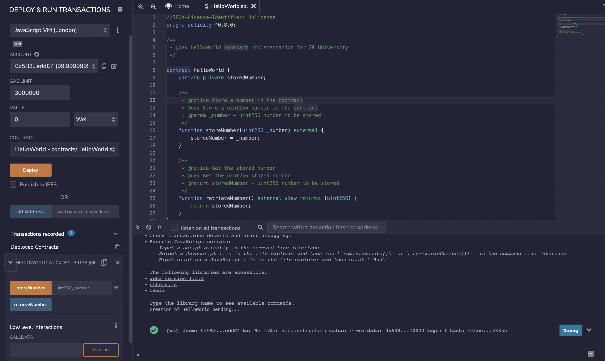
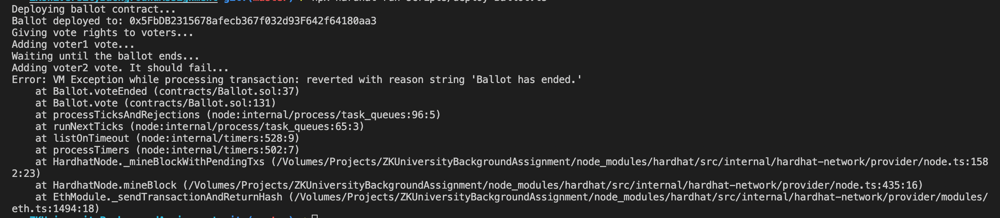

# Zero Knowledge University Background Assignment

## A. Conceptual Knowledge

1. *What is a smart contract? How are they deployed? You should be able to describe how a smart contract is deployed and the necessary steps.*

- A smart contract is a computer program that lives on the blockchain. That means that anyone can interact with it and that the internal state persists in the blockchain in a public and permantent way.
Steps needed for smart contract deployment:
  - Write the contract source code in a .sol file
  - Compile the source code to bytecode using a tool such as hardhat compiler.
  - Send the compiled code to the blockchain using an account with eth for gas (or the blockchain's native token that you are using) with the required information for deployment (constructor parameters).
  - Wait until the contract is deployed (until the required transaction is included on the blockchain).
  - If needed you can verify your source code using a hardhat plugin.
  

2. *What is gas? Why is gas optimization such a big focus when building smart contracts?*

- Gas is the mesure of the computational effort required for a transaction to be executed on the network and to be included in a block on the blockchain. Gas has a unit/cost that depends on the current state of the network. In order to include a transaction on the blockchain, the user should paid the required gas price in eth from his own balance.

3. *What is a hash? Why do people use hashing to hide information?*

A hash is an unique alphanumeric footprint derived from a source (text, file, etc) with the unique property that you would get the same exact hash using the same source every time you calcule it. It's used for validations and integrity checks. For example, you can know if a file was changed if you have an older valid hash and you compare that hash with a recalculated one using the file as the source. If the file is valid then the hashes must be equal. You can use hashes to validate that a user password is correct, storing the hash of the valid password and compare it with a new recalculated hash from the user's input. If the password is the same then the hashes must be equal and on that way you don't need to store the actual password.

4. *How would you prove to a colorblind person that two different colored objects are actually of different colors? You could check out Avi Wigderson talk about a similar problem [here](https://www.youtube.com/watch?v=5ovdoxnfFVc&t=4s).*

If the objects have the same shape then you can give the objects to your friend. He can put them behind his back and show you one of them randomly. Then you can say to your friend what color that object has, and repeat the process until your friend is convinced that both objects have different colors.

## B. **You sure you’re solid with Solidity?**

1. *Program a super simple “Hello World” smart contract: write a `**storeNumber**` function to store an unsigned integer and then a `**retrieveNumber**` function to retrieve it. Clearly comment your code. Once completed, deploy the smart contract on [remix](http://remix.ethereum.org/). Push the .sol file to Github or Gist and include a screenshot of the Remix UI once deployed in your final submission pdf.*

- **[Contract code can be found here](https://github.com/nicobevilacqua/ZKUniversityBackgroundAssignment/tree/master/contracts/HelloWorld.sol)**
- **[Test code can be found here](https://github.com/nicobevilacqua/ZKUniversityBackgroundAssignment/tree/master/test/HelloWorld.test.ts)**
- **[Deployment script code can be found here](https://github.com/nicobevilacqua/ZKUniversityBackgroundAssignment/tree/master/scripts/deploy-HelloWorld.ts)**

### Screenshots

2. *On the documentation page, [the “Ballot” contract](https://docs.soliditylang.org/en/v0.8.11/solidity-by-example.html#voting) demonstrates a lot of features on Solidity. Read through the script and try to understand what each line of code is doing.*

3. *Suppose we want to limit the voting period of each Ballot contract to **5 minutes**. To do so, implement the following: Add a state variable **`startTime`** to record the voting start time. Create a [modifier](https://www.youtube.com/watch?v=b6FBWsz7VaI) **`voteEnded`** that will check if the voting period is over. Use that modifier in the `**vote**` function to forbid voting and revert the transaction after the deadline.*

- **[Contract code can be found here](https://github.com/nicobevilacqua/ZKUniversityBackgroundAssignment/tree/master/contracts/Ballot.sol)**
- **[Test code can be found here](https://github.com/nicobevilacqua/ZKUniversityBackgroundAssignment/tree/master/test/Ballot.test.ts)**

4. *Deploy your amended script and test the newly implemented functionality in part 3. Submit (1) your amended version of the contract on Github or Gist and (2) screenshots showing the time of contract deployment as well as the transaction being reverted once past the voting period.*

- **[Deploy script can be found here](https://github.com/nicobevilacqua/ZKUniversityBackgroundAssignment/tree/master/scripts/deploy-Ballot.ts)**
- **[Test script can be found here](https://github.com/nicobevilacqua/ZKUniversityBackgroundAssignment/tree/master/test/Ballot.test.ts)**

#### Screenshots:

